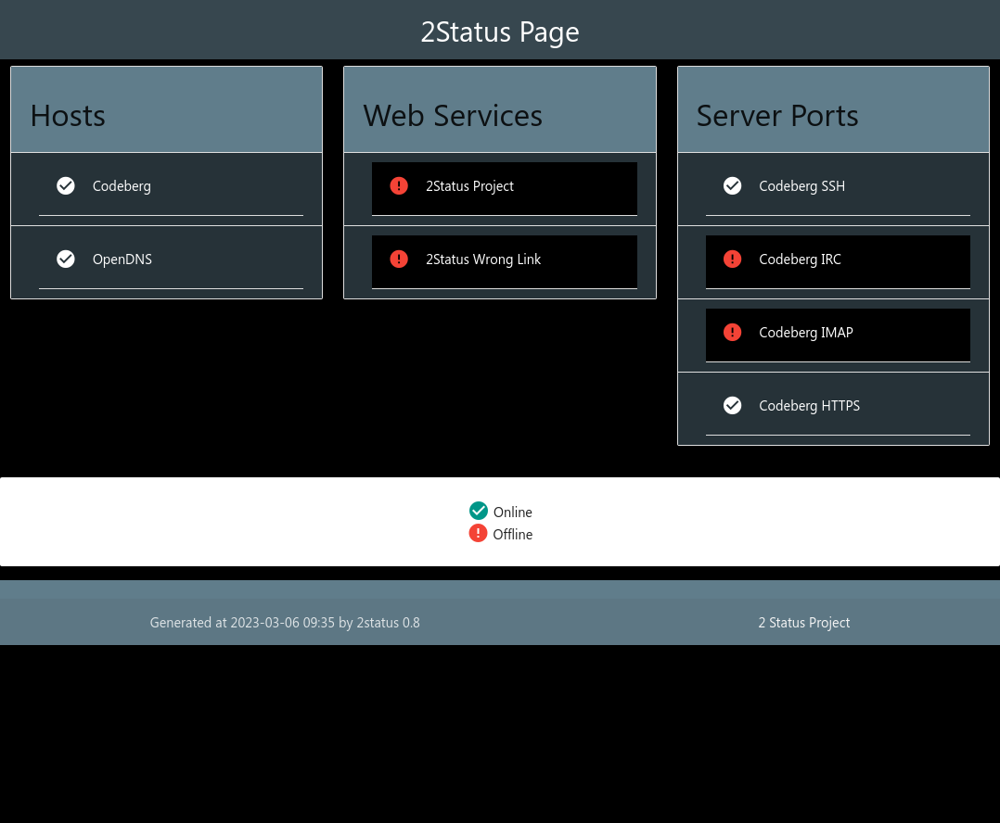
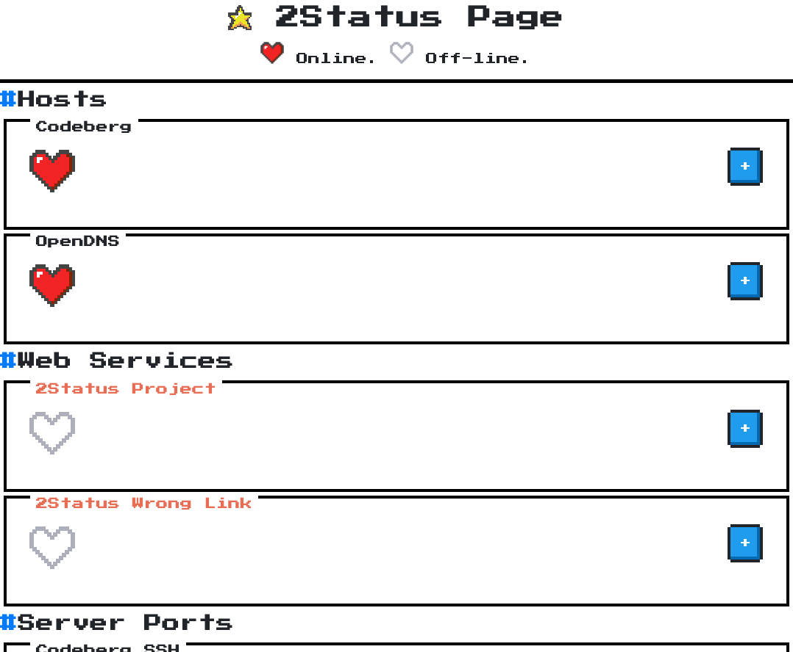

# 2status

Simple public status page. You can see it working in [2Status Cordéis](https://status.cordeis.com/).

A server status page using NH1, generating a static page.

## Screenshot (0.8)

| Template mat | Template matdark | Template nes |
|-|-|-|
|  |  |  |

## Install

First, you need to install [NH1](https://codeberg.org/cordeis/nh1). If you're using NH1 in your bashrc, it's done. Else, you can put nh1 folder inside 2status folder.

Edit 2status.conf-example and rename it to 2status.conf:

* **OUTDIR** = output HTML path
* **TITLE** = Page title

You can check status in 3 ways:

* **HOST** = Test IP with ping
* **WEB** = Check HTTP status from given URL
* **PORT** = Check if some TCP port is open

Now you can use a host group from NH1:

* **1HOSTGROUP** = Host group saved with 1hostgroup and 1hostset
* **1HGPORT** = Test a port for all hosts in a hostgroup

**2status** will run and build a static index.html. So, you need to configure Cron to run 2status every minute, every 5 minutes or what you want.

